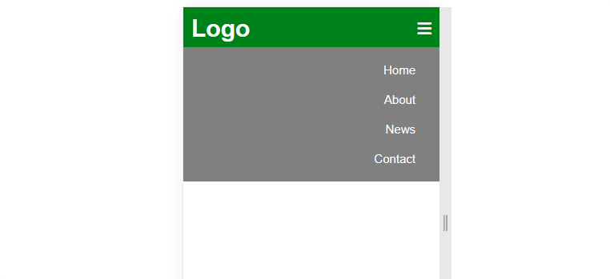
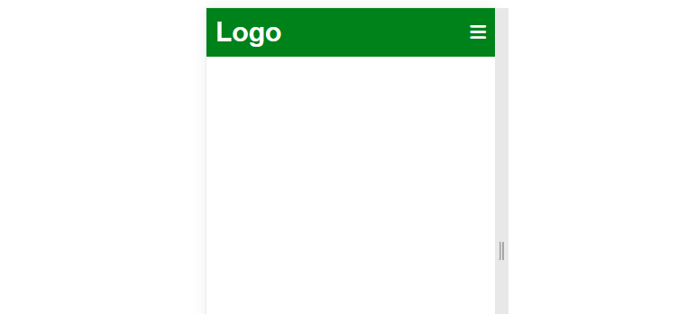

# How to Create Navigation bar(Navbar) that Responds to different Screen sizes

95% of websites are built with a navbar attached at the top, which looks good on different screen sizes. Navbar helps users to access information fast and easily. To make your website user-friendly and interactive; attach a navbar to the top of your website.

In this tutorial, you'll learn the following:
* What is a Navbar?
* Steps to Create Navbar that Responds to Different Screen Sizes Using:
  - Html
  - CSS
  - Media query
  - JavaScript

Learn [HTML](https://www.w3schools.com/html/), [CSS](https://www.w3schools.com/Css/), [Mediaqueries](https://www.w3schools.com/css/css3_mediaqueries.asp), and [JavaScript](https://www.w3schools.com/js/DEFAULT.asp); if you don't have the basic knowledge to continue this tutorial.
## What is a Navbar?
Before we dive deeper into this tutorial, what is a navbar?


A **Navbar** is the section of a web page interface that helps users to access information on a website easily. Navbars are implemented in the following user interfaces:
* operating system
* websites
* file browsers
* apps

### Steps to Create Navbar that Responds to Different Screen Sizes

Take the following steps to create a navbar that responds to different screen sizes:
1. Write your HTML code.
2. Add CSS to style your navbar.
3. Make your navbar responsive using media queries.
4. Make your navbar toggleable using JavaScript.

**1. Write Your HTML Code**

***Code***
```ruby
<!DOCTYPE html>
<html lang="en">
<head>
    <meta charset="UTF-8">
    <meta http-equiv="X-UA-Compatible" content="IE=edge">
    <meta name="viewport" content="width=device-width, initial-scale=1.0">
    <title>navbar</title>
    <!--external css file linked here-->
    <link rel="stylesheet" href="style.css">
    <!--font awesome url linked here to enable display font-icon-->
    <script src="https://kit.fontawesome.com/58b7424050.js" crossorigin="anonymous"></script>
</head>
<body>
    <div class="navbar">
        <label class="logo"><h1>Logo</h1></label>
        <nav>
            <ul id="menulist">
                <li><a href="#">Home</a></li>
                <li><a href="#">About</a></li>
                <li><a href="#">News</a></li>
                <li><a href="#">Contact</a></li>
            </ul>
        </nav>
        <label class="icon"><i class="fa fa-bars" onclick="togglemenu()"></i></label>
    </div>
</body>
</html>
```
***Result***


**2. Add CSS to style your navbar**

***Code***
```ruby
*{
    margin: 0;
    padding: 0;
    font-family: Arial, Helvetica, sans-serif;
}
.navbar{
    width:100%;
    display: flex;
    align-items: center;
    background-color: #008000;
    z-index: 2;
}
.logo{
    font-size: 15px;
    font-weight: bolder;
    margin: 10px;
    color: #fff;
    cursor: pointer;
}
.icon{
    font-size: 20px;
    margin: 10px;
    color: #fff;
    cursor: pointer;
    display: none;
}
nav{
    text-align: right;
}
nav ul li{
    list-style-type: none;
    display: inline-block;
    margin: -12px 30px;
}
nav ul li a{
    text-decoration: none;
    color: #fff;
    font-size: 20px;
}
nav ul li a:hover{
    text-decoration: underline;
}
```
`Note: This is external CSS file, ensure to link it to your html file;above the heading closing tag.`

***Result***


**3. Make your navbar responsive using Media queries**

***Code**
```ruby
/*screen with width less than or equal to 576px*/
@media only screen and (max-width: 576px) {
    nav{
      flex: 1;
    }
    nav ul{
      width: 100%;
      background-color: #808080;
      position: absolute;
      top: 50px;
      right: 0;
      z-index: 2;
  
    }
    nav ul li{
      display: block;
      margin-top: 20px;
      margin-bottom: 20px;
    }
    
    nav ul li a {
      color: #ffffff;
      font-size: 15px;
    }
    .icon{
      display: block;
    }
    #menulist{
      overflow: hidden;
      transition: 1.5s;
    }
  }
```
`your media query code should be in your CSS file below your css code`

***Result***

Resize your screen to see the effect.



**4. Make your navbar toggleable using JavaScript.**

***Code**
```ruby
 <!--javascript embedded above the closing body tag-->
    <script>
        var menulist = document.getElementById("menulist")
        menulist.style.maxHeight = "0px"
        function togglemenu(){
            if(  menulist.style.maxHeight == "0px"){
                menulist.style.maxHeight = "160px"
            }
            else{
                menulist.style.maxHeight = "0px"
            }
        }
    </script>
```
 `This is internal JavaScript file, your JavaScript code should be above body closing tag of your HTML file.`
 
 ***Result***
 


`click on the button to see how it displays and hide the menulist`
#### Conclusion
In this tutorial you were able to learn how to create a navbar that responds to different screen sizes using **HTML, CSS Media query, and JavaScript.**
You can visit my [git repository](https://github.com/mbamobioma1) to copy and reuse the code.
If this tutorial is helpful comment and follow me on [Twitter](https://twitter.com/FidelisObioma) for daily tips on web development.
